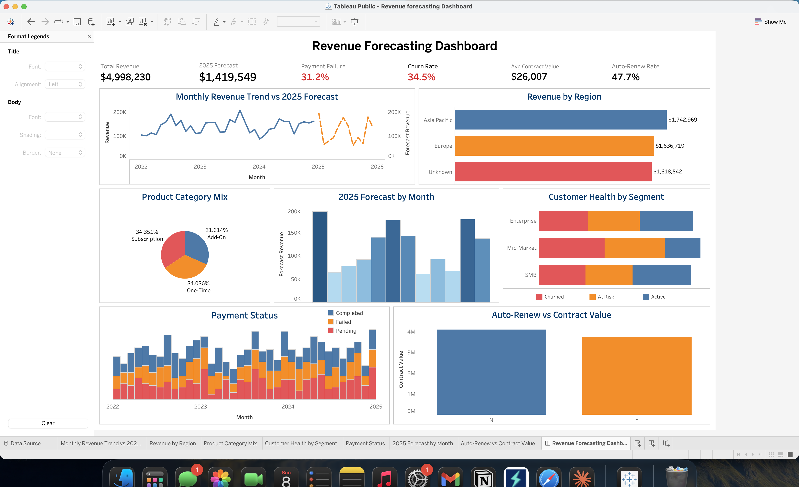

# Subscription Revenue Forecasting Dashboard

🔗 **Live Dashboard (Tableau Public):**
[Add your Tableau Public link here]

🔗 **Live Interactive Notebook (Hex):**
[Add your Hex link here]

---

## Executive Summary

A subscription-based business generating $4,998,230 in revenue
over 3 years faces critical operational risks that threaten 2025
growth targets. This project performs end-to-end data analysis
across 8 datasets covering revenue, customers, contracts and
payments to identify where revenue is being lost and what actions
will protect the $1,419,549 forecast for 2025.

The analysis shows that 31.2% of payments fail every single month,
32% of revenue cannot be attributed to any region, and 34.5% of
customers have churned — all pointing to systemic operational gaps
that have gone undetected because each team was only looking at
their own slice of the data.

These findings highlight three high-impact opportunities: fixing
payment infrastructure to recover one third of expected monthly
revenue, resolving regional data gaps to enable accurate territory
performance measurement, and implementing a customer retention
programme before churn erodes the 2025 revenue base.

---

## Business Problem

The finance team came to you one day concerned that payments were
failing at an unusually high rate and that nobody could answer
whether the business was on track to hit its 2025 revenue targets.
As a data analyst you know these concerns are valid and worth
digging into, so you immediately pull up the data. The business
has been running for 3 years across 200 customers and 1,000
revenue transactions — but the data has never been properly
analysed. After sitting down with the data you quickly realise
why nobody has been able to answer these questions. 32% of revenue
records have no region attached, 51% of contracts have their start
and end dates completely swapped, and most urgently — 31.2% of
payments are failing every single month without any monitoring in
place. You put together a plan to clean all 8 datasets using SQL,
build a Tableau dashboard that answers the questions leadership is
asking, and come back with concrete recommendations that protect
the $1,419,549 forecast for 2025.

---

## Methodology

- Exploratory Data Analysis (EDA)
- Data Quality Assessment
- Data Cleaning & Preprocessing
- Time Series Analysis
- Customer Cohort Analysis
- Revenue Attribution Analysis
- Dashboard Design & Visualisation

---

## Skills

- SQL (DuckDB Views, CASE statements, UNION ALL, LEFT JOIN,
  COALESCE, STRPTIME, DATE functions)
- Python (pandas, duckdb)
- Data Cleaning & Preprocessing
- Data Visualisation
- Dashboard Design
- Hex Data Science Notebook
- Tableau Public

---

## Results & Business Recommendations

---

### Chart 1 — Monthly Revenue Trend vs 2025 Forecast

Monthly revenue has stayed consistently between $80K and $210K
since 2022 with clear seasonal dips every August and October.
The 2025 forecast follows the same seasonal pattern, peaking in
January at $193,949 and dropping to a low of $60,534 in August.
This tells us the business is stable but predictable — and without
proactive campaigns during the low months, the same revenue gaps
will repeat in 2025.

---

### Chart 2 — Revenue by Region

Asia Pacific leads at $1,742,969 followed closely by Europe at
$1,636,719 — but the most concerning finding is that $1,618,542
in revenue carries no region attribution at all. This happened
because 32% of transactions were recorded without a region code,
making it impossible to accurately measure which territory is
actually performing. Until the region tagging is fixed at source,
no regional investment or sales decisions can be made with
confidence.

---

### Chart 3 — Product Category Mix

Revenue is split almost equally across Add-On at 34.4%,
Subscription at 34% and One-Time at 31.6%. This even split
exists because the business sells across all three categories
without a dominant focus. While diversification reduces risk,
the Subscription segment is the most strategically valuable
as it generates predictable recurring revenue — and growing
it at the expense of One-Time revenue would significantly
improve forecast reliability.

---

### Chart 4 — Customer Health by Segment

Across Enterprise, Mid-Market and SMB only one third of
customers are Active while the remaining two thirds are either
At Risk or Churned. This pattern is identical across every
segment which tells us churn is not a segment-specific problem
— it is a company-wide retention failure. Without a structured
customer success programme the business risks losing a further
third of its remaining base before 2025 targets can be met.

---

### Chart 5 — Payment Status by Month

Every single month from 2022 to 2024 shows the same pattern —
roughly one third of payments complete, one third fail and one
third remain pending. This consistency confirms that payment
failures are not caused by seasonal spikes or one-off outages
but by a fundamental flaw in the payment infrastructure. At
31.2% failure rate the business is silently losing nearly one
third of expected revenue every month without any alerting or
intervention in place.

---

### Chart 6 — 2025 Forecast by Month

The 2025 forecast predicts $1,419,549 in total revenue with
January as the peak month at $193,949 and August as the lowest
at $60,534. The forecast mirrors the seasonal patterns seen in
historical data which gives confidence in the directional
accuracy of the predictions. This monthly breakdown gives the
business a clear roadmap to align sales capacity, marketing
spend and operational resources ahead of each peak and trough.

---

### Chart 7 — Auto-Renew vs Contract Value

$4,100,000 in contract value — over half the total — sits in
contracts that require manual renewal every cycle. This means
the sales team must actively re-sell more than half the contract
base each year just to maintain current revenue levels. Without
a structured renewal process and early outreach programme, this
$4.1M in contract value is at risk of being lost with very
little warning.

---

## Next Steps

- Build a **churn prediction model** using customer tenure,
  payment history and contract value to identify at-risk
  customers before they churn
- Investigate **Unknown region records** by cross-referencing
  with customer billing addresses to recover attribution for
  $1.62M in revenue
- Categorise **payment failure reasons** to determine whether
  failures are user-side or vendor-side and target the right
  intervention
- Build a **time series forecast model** using ARIMA or Prophet
  for more accurate seasonality-adjusted 2025 predictions
- Add **customer lifetime value analysis** by segment and
  product category to identify highest-value customer profiles
