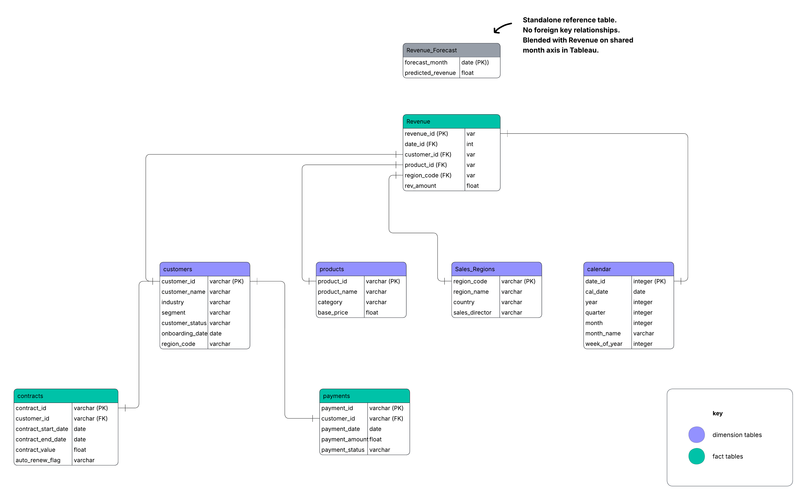
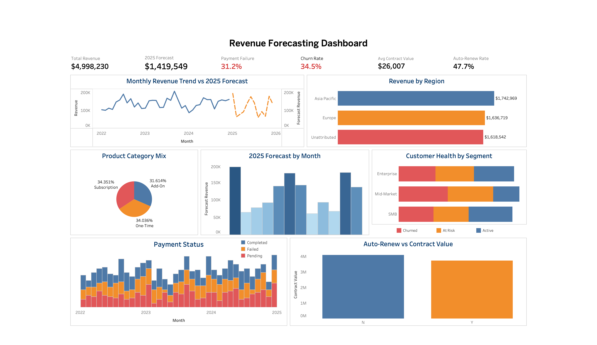

# Subscription Revenue Forecasting Dashboard

A subscription-based software business generating $4,998,230 in revenue over 3 years needed to understand why payments were failing and whether the business was on track for 2025. Using SQL and Tableau, I analysed 8 datasets across revenue, customers, contracts and payments — uncovering three critical operational failures and building a dashboard that gives leadership the visibility they need to protect the $1,419,549 forecast for 2025.

🔗 **Live Dashboard (Tableau Public):** [https://public.tableau.com/views/RevenueforecastingDashboard/RevenueForecastingDashboard?:language=en-US&:sid=&:redirect=auth&:display_count=n&:origin=viz_share_link]

🔗 **Live Interactive Notebook (Hex):** [https://app.hex.tech/0199335d-610a-7001-9c7d-fb84db58160d/hex/Revenue-Forecasting-032bRanDe95CkPO2N4C4q1/draft/logic]

---

## Executive Summary

A subscription-based business generating $4,998,230 in revenue over 3 years faces critical operational risks that threaten 2025 growth targets. The analysis reveals that 31.2% of payments fail every single month, 32% of revenue cannot be attributed to any region, and 34.5% of customers have churned — all pointing to systemic gaps that went undetected because each team was only looking at their own slice of the data. This project performs end-to-end data analysis across 8 datasets to identify where revenue is being lost and what actions will protect the $1,419,549 forecast for 2025.

---

## Business Problem

Payment failures were climbing with no monitoring in place and leadership had no visibility into whether 2025 targets were achievable. After pulling all 8 datasets the root causes became clear — 32% of revenue unattributed, 51% of contract dates swapped, and 31.2% of payments failing every single month. This project cleans the data using SQL, builds a Tableau dashboard to answer the key questions, and delivers recommendations to protect the $1,419,549 forecast.

---

## Methodology

- Exploratory Data Analysis (EDA)
- Data Quality Assessment & Cleaning
- Star Schema Data Modelling
- Time Series Visualisation & Trend Analysis
- Customer Segmentation Analysis
- Revenue Attribution Analysis
- Dashboard Design & Visualisation (Tableau Public)

---

## Skills

- SQL
- Tableau Public
- Data Modelling
- Data Cleaning
- Business Intelligence

---

## Results & Business Recommendations

31.2% of payments fail every month, $1.62M in revenue has no regional attribution, and churn is identical across every customer segment — the business has been running blind on all three of its most critical risk areas. Here is what each chart found and what should be done about it.

### Chart 1 — Monthly Revenue Trend vs 2025 Forecast
Monthly revenue stayed between $80K–$210K since 2022 with seasonal dips every August and October. The 2025 forecast mirrors this pattern, peaking in January at $193,949 and dropping to $60,534 in August. The forecast line begins where actual revenue ends — January 2025 — giving a clear visual handoff between historical performance and projected targets. Proactive campaigns during low months are needed to prevent the same revenue gaps repeating in 2025.

### Chart 2 — Revenue by Region
Asia Pacific leads at $1,742,969, Europe at $1,636,719, and North America at $1,618,542. The three regions are nearly equal in contribution, suggesting no single region is driving outsized growth. Regional sales and marketing investment should be evaluated against these baselines to determine where incremental spend would have the highest return.

### Chart 3 — Product Category Mix
Revenue splits near-equally across Add-On at 34.4%, Subscription at 34% and One-Time at 31.6%. Subscription is the most strategically valuable category as it generates predictable recurring revenue. Shifting focus from One-Time to Subscription products would improve forecast reliability and make the $1,419,549 target for 2025 more defensible.

### Chart 4 — Customer Health by Segment
Across Enterprise, Mid-Market and SMB only one third of customers are Active — the remaining two thirds are At Risk or Churned. The churn rate is identical across every segment, confirming this is a company-wide retention failure, not a segment-specific one. A structured customer success programme is needed before churn erodes the remaining active base ahead of 2025.

### Chart 5 — Payment Status by Month
Every month from 2022 to 2024 shows the same split — one third complete, one third fail, one third pending. The consistency rules out seasonal spikes or one-off outages and points to a fundamental flaw in the payment infrastructure. At 31.2% failure rate the business is losing nearly one third of expected monthly revenue with no alerting or intervention in place.

### Chart 6 — 2025 Forecast by Month
The 2025 forecast predicts $1,419,549 in total revenue with January peaking at $193,949 and August as the lowest at $60,534. The forecast mirrors historical seasonal patterns, giving confidence in its directional accuracy. This monthly breakdown gives the business a clear roadmap to align sales capacity and marketing spend ahead of each peak and trough.

### Chart 7 — Auto-Renew vs Contract Value
$4,090,434 in contract value sits in contracts requiring manual renewal every cycle, compared to $3,711,784 on auto-renew. Over half the contract base must be actively re-sold each year just to hold current revenue levels. A structured renewal outreach programme and incentives to move customers onto auto-renew are needed to protect this $4.1M from quietly lapsing.

---

## Next Steps

1. Investigate North America regional revenue by cross-referencing customer billing addresses to validate attribution accuracy
2. Categorise payment failure reasons to determine whether the fix sits with the payment gateway or internal engineering
3. Build a churn prediction model using customer tenure, payment history and contract value to identify at-risk customers early
