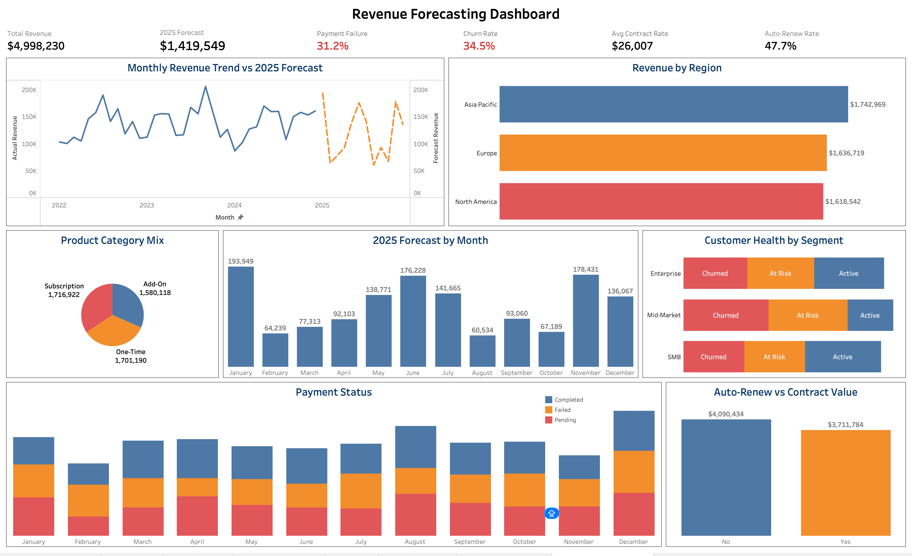

# Subscription Revenue Forecasting Dashboard

A subscription-based software business generating $4,998,230 in revenue over 3 years needed to understand why payments were failing and whether the business was on track for 2025. Using SQL and Tableau, I analysed 8 datasets across revenue, customers, contracts and payments — uncovering three critical operational failures and building a dashboard that gives leadership the visibility they need to protect the $1,419,549 forecast for 2025.

🔗 **Live Dashboard (Tableau Public):**
[View Dashboard](https://public.tableau.com/views/RevenueforecastingDashboard/RevenueForecastingDashboard?:language=en-US&:sid=&:redirect=auth&:display_count=n&:origin=viz_share_link)

🔗 **Live Interactive Notebook (Hex):**
[View Notebook](https://app.hex.tech/0199335d-610a-7001-9c7d-fb84db58160d/app/Project-Revenue-Forecasting-032hk4aDJ3fPwnmcbahwkV/latest)
---

## Executive Summary

A subscription-based software business generating $4,998,230 in revenue over 3 years faces critical operational risks that threaten 2025 growth targets. The analysis reveals that 31.2% of payments fail every single month, 34.5% of customers have churned, and over half of total contract value — $4,090,434 — sits in contracts requiring manual renewal. All three failures went undetected because each team was only looking at their own slice of the data. This project performs end-to-end data analysis across 8 datasets to identify where revenue is being lost and what actions will protect the $1,419,549 forecast for 2025.

---

## Business Problem

Payment failures were climbing with no monitoring in place and leadership had no visibility into whether 2025 targets were achievable. After pulling all 8 datasets the root causes became clear — 31.2% of payments failing every single month, churn running at 34.5% uniformly across all three customer segments, and more than half the contract base requiring active re-selling each renewal cycle. This project cleans the data using SQL, builds a Tableau dashboard to answer the key questions, and delivers recommendations to protect the $1,419,549 forecast.

---

## Methodology

- Exploratory Data Analysis (EDA)
- Data Quality Assessment & Cleaning
- Star Schema Data Modelling
- Time Series Visualisation & Trend Analysis
- Customer Segmentation Analysis
- Revenue Attribution Analysis
- Dashboard Design & Visualisation (Tableau Public)

---

## Skills

- SQL
- Tableau Public
- Data Modelling
- Data Cleaning
- Business Intelligence

---

## Results & Business Recommendations

31.2% of payments fail every month, churn is identical across every customer segment at 34.5%, and $4.1M in contract value requires manual renewal each cycle — the business has been running blind on all three of its most critical risk areas. Here is what each chart found and what should be done about it.

### Chart 1 — Monthly Revenue Trend vs 2025 Forecast
Monthly revenue stayed between $80K–$210K since 2022 with seasonal dips every August and October. The 2025 forecast mirrors this pattern, peaking in January at $193,949 and dropping to $60,534 in August. Proactive campaigns during low months are needed to prevent the same revenue gaps repeating in 2025.

### Chart 2 — Revenue by Region
Asia Pacific leads at $1,742,969, Europe at $1,636,719, and North America at $1,618,542. Revenue is relatively balanced across all three regions, but accurate regional attribution depends on consistent region coding at the point of data entry — any gaps would make it impossible to measure which territory is actually performing. Regional investment and sales decisions should be validated against data completeness before being acted on.

### Chart 3 — Product Category Mix
Revenue splits near-equally across Subscription at $1,716,922 (34.4%), One-Time at $1,701,190 (34%), and Add-On at $1,580,118 (31.6%). Subscription is the most strategically valuable category as it generates predictable recurring revenue. Shifting focus from One-Time to Subscription products would improve forecast reliability and make the $1,419,549 target for 2025 more defensible.

### Chart 4 — Customer Health by Segment
Across Enterprise, Mid-Market and SMB, 34.5% of customers have churned and a further 34% are At Risk — leaving only around one third of the customer base Active. The churn rate is consistent across every segment, confirming this is a company-wide retention failure, not a segment-specific one. A structured customer success programme is needed before churn erodes the remaining active base ahead of 2025.

### Chart 5 — Payment Status by Month
Every month from 2022 to 2024 shows the same split — 34.5% completed, 31.2% failed, 34.3% pending. The consistency rules out seasonal spikes or one-off outages and points to a fundamental flaw in the payment infrastructure. At 31.2% failure rate the business is losing nearly one third of expected monthly revenue with no alerting or intervention in place.

### Chart 6 — 2025 Forecast by Month
The 2025 forecast predicts $1,419,549 in total revenue with January peaking at $193,949 and August as the lowest at $60,534. The forecast mirrors historical seasonal patterns, giving confidence in its directional accuracy. This monthly breakdown gives the business a clear roadmap to align sales capacity and marketing spend ahead of each peak and trough.

### Chart 7 — Auto-Renew vs Contract Value
$4,090,434 in contract value — over half the total — sits in contracts requiring manual renewal every cycle. The sales team must actively re-sell more than half the contract base each year just to hold current revenue levels. A structured renewal outreach programme and incentives to move customers onto auto-renew are needed to protect this $4.1M from quietly lapsing.

---

## Next Steps

1. Categorise payment failure reasons to determine whether the fix sits with the payment gateway or internal engineering
2. Build a churn prediction model using customer tenure, payment history and contract value to identify at-risk customers early
3. Launch a structured auto-renew conversion campaign targeting the $4.09M in manually renewed contracts before the next renewal cycle
